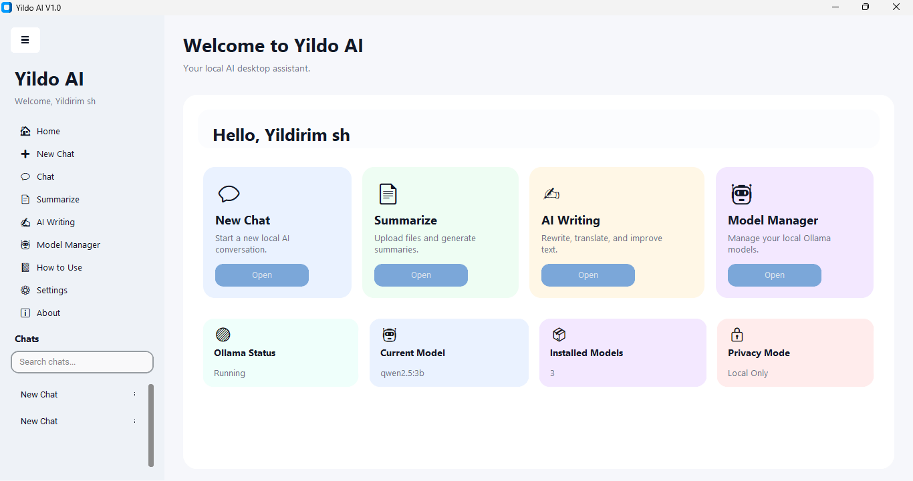
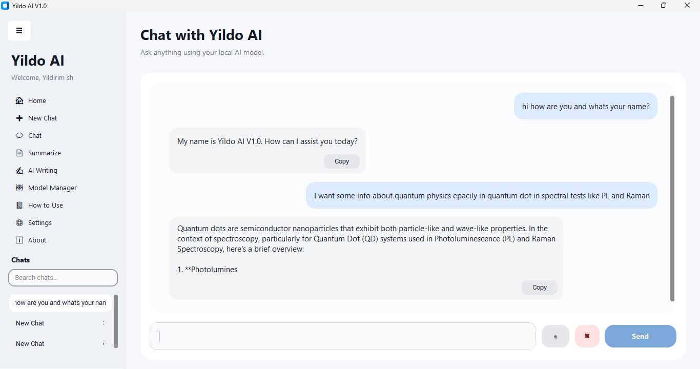
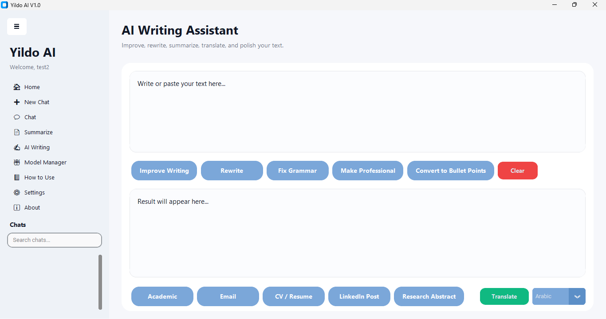

# YILDO AI V1.0

Local Offline Artificial Intelligence Assistant

## About

YILDO AI is a local desktop artificial intelligence assistant designed to run directly on the user's computer without requiring cloud-based processing. The system supports multiple languages, including Arabic, English, and Turkish, and provides intelligent tools for chatting, document processing, and summarization.

The project was developed by Yildirim Salahaldin Hussein to provide a privacy-focused and user-friendly AI experience with local processing capabilities.

---

## Features

* Local AI processing
* Arabic language support
* English language support
* Turkish language support
* Document summarization
* Multi-model support
* User account management
* Conversation history
* Privacy-focused design
* Offline operation

---

## System Requirements

Operating System:

* Windows 10 or Windows 11

Minimum RAM:

* 8 GB

Recommended RAM:

* 16 GB or higher
  
Minimum GPU:

* 4 GB

Recommended GPU:

* 8 GB or higher
  
Storage:

* 10 GB free space

Processor:

* Intel Core i5 or equivalent

---

## Installation

1. Download the latest release from the official page.
2. Run YILDO_AI_Setup.exe and follow the installation wizard.
3. Navigate to the Settings page within the application.
4. Verify the Ollama status. (If Ollama is not installed, download and install it on your PC first).
5. From the Models section. Download the specific models you require, or download all of them.
6. Complete the remaining installation and configuration steps.
7. Launch YILDO AI.
8. Create a new account or sign in to your existing account.
9. The system is now fully configured and ready for offline use.
10. Start using the system.

---------------------------------------------
## From Assets download (Yildo.Ai.V1.0.zip)

## Download Link

https://github.com/Yildirimshh/Yildo-ai/releases/tag/V1.0.1

----------------------------------------------

## Screenshots

### Home Page

### Chat Interface

### Ai Writing Page

---

## Developer

Inv. Yildirim Salahaldin Hussein
Academic and the first inventor in Iraq and globally to obtain a
patent in artificial intelligence algorithms (NLP–OCR). Achieved
significant research and practical contributions in artificial
intelligence, applied statistics, and programming. Holder of the
(Inv.) – Certified Inventor title from IFIA (Geneva), with recognitions
from OpenAI, IEEE, ScoreDetect, and OriginStamp. Developer of
impactful AI systems (Search, Eco Predict, Chot, Smastatic) and
author of the book Research and Advanced Technology Centers
and Artificial Intelligence – AI.
---

## Citation

If you use YILDO AI in research, publications, or academic work, please cite the software using the provided citation information.

DOI:
https://doi.org/10.5281/zenodo.20759311
---

## License

This project is distributed under the MIT License.

---

## Contact

GitHub:
https://github.com/Yildirimshh

LinkedIn:
https://iq.linkedin.com/in/inv-yildirim-s-h-492b65117

Google Scholar:
https://scholar.google.com/citations?user=9XP3qjYAAAAJ&hl=tr

ORCID:
https://orcid.org/0009-0007-7411-1503
